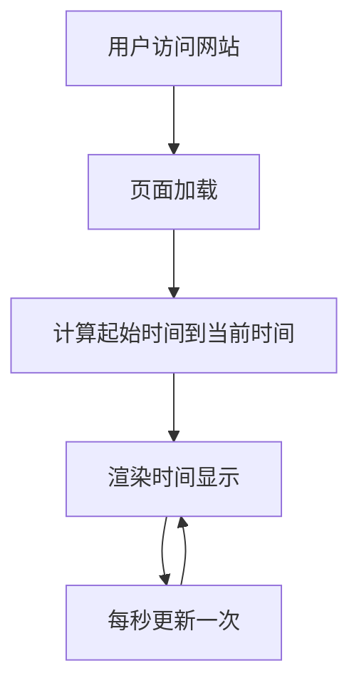

# 产品需求文档 (PRD)

## 1. 产品概述
这是一个纪念日正计时网页应用，用于记录和展示从2026年6月27日20:23开始至今的时间。页面以温馨浪漫的设计风格呈现"纪念荔枝第{time}天"的主题，为用户提供一个有情感价值的时间记录体验。

**目标用户：** 想要纪念特殊日期、记录重要时刻的用户

**核心价值：** 用精美的视觉设计将时间可视化，让纪念变得更有仪式感和美感

## 2. 核心功能

### 2.1 用户角色
无需用户角色区分，所有访客都可以查看正计时页面

### 2.2 功能模块
1. **正计时页面**: 实时显示从起始时间到现在的时间差，包括天、小时、分钟、秒的精确计算

### 2.3 页面详情

| 页面名称 | 模块名称 | 功能描述 |
|---------|---------|---------|
| 正计时页面 | 时间显示区 | 实时显示距离起始时间的天数、小时、分钟、秒数，使用大字体突出显示 |
| 正计时页面 | 主题标题区 | 显示"纪念荔枝第{time}天"的主题文字，配合装饰性动画效果 |
| 正计时页面 | 背景装饰区 | 使用渐变色、粒子效果或装饰性元素营造浪漫氛围 |

## 3. 核心流程

用户访问网站 → 页面自动加载并计算从2026/6/27 20:23至今的时间差 → 实时更新显示（每秒刷新）→ 用户可以长时间停留在页面观看时间流逝

## 4. 用户界面设计

### 4.1 设计风格
- **主色调**: 温暖的粉橙色系渐变（#FF6B6B到#FFA07A），营造温馨浪漫的氛围
- **辅助色**: 淡紫色（#E8DFF5）和柔和白色
- **字体**: 使用优雅的衬线字体作为标题字体，现代无衬线字体用于时间数字显示
- **布局**: 居中对齐，垂直分布，大量留白营造优雅感
- **动画**: 数字翻转动画、淡入淡出效果、背景渐变流动

### 4.2 页面设计概述

| 页面名称 | 模块名称 | UI元素 |
|---------|---------|--------|
| 正计时页面 | 主题标题区 | 使用优雅的衬线字体，显示"纪念荔枝"，副标题显示"第X天"，配合微妙的发光效果 |
| 正计时页面 | 时间显示区 | 超大号数字显示天数，中等字号显示小时、分钟、秒，使用粗体无衬线字体，每个时间单位用方框包裹 |
| 正计时页面 | 装饰元素区 | 漂浮的荔枝图标或花瓣形状，缓慢旋转和移动的动画效果 |
| 正计时页面 | 背景 | 渐变色背景，从浅粉到橙色的对角线渐变，配合半透明的几何图形装饰 |

### 4.3 响应式设计
- 桌面优先设计，在大屏幕上展示最佳的视觉效果
- 移动端自适应：缩小字体、调整间距，保持核心时间显示清晰可见
- 触摸优化：无需交互，仅展示

### 4.4 视觉特效
- 数字更新时的微妙翻转动画
- 背景渐变的缓慢流动效果
- 装饰性元素的漂浮动画
- 页面加载时的淡入效果