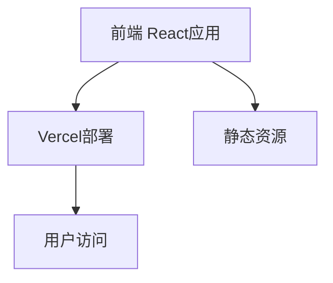

# 技术架构文档

## 1. 架构设计



## 2. 技术说明

- **前端框架**: React@18 + TypeScript
- **样式方案**: Tailwind CSS@3
- **构建工具**: Vite@latest
- **部署平台**: Vercel
- **版本控制**: Git + GitHub
- **无后端**: 纯静态站点，所有计算在客户端进行

## 3. 路由定义

| 路由 | 用途 |
|-----|------|
| / | 主页面，显示正计时 |

## 4. API定义
无需API，所有数据计算在客户端进行

## 5. 服务器架构
无服务器架构，纯前端静态站点

## 6. 数据模型

### 6.1 数据模型定义
无需数据库，仅使用客户端状态管理时间数据

### 6.2 时间计算逻辑
- **起始时间**: 2026年6月27日 20:23:00 (北京时间)
- **计算方式**: 使用JavaScript Date对象计算时间差
- **更新频率**: 每秒更新一次
- **显示格式**: 天、小时、分钟、秒

```typescript
interface TimeDifference {
  days: number;
  hours: number;
  minutes: number;
  seconds: number;
}

// 计算函数示例
function calculateTimeDifference(startDate: Date): TimeDifference {
  const now = new Date();
  const diff = now.getTime() - startDate.getTime();

  const days = Math.floor(diff / (1000 * 60 * 60 * 24));
  const hours = Math.floor((diff % (1000 * 60 * 60 * 24)) / (1000 * 60 * 60));
  const minutes = Math.floor((diff % (1000 * 60 * 60)) / (1000 * 60));
  const seconds = Math.floor((diff % (1000 * 60)) / 1000);

  return { days, hours, minutes, seconds };
}
```

## 7. 项目结构

```
jinianlz/
├── src/
│   ├── App.tsx              # 主应用组件
│   ├── main.tsx             # 应用入口
│   ├── components/
│   │   ├── TimeDisplay.tsx  # 时间显示组件
│   │   └── Decorations.tsx  # 装饰元素组件
│   ├── hooks/
│   │   └── useTimeCounter.ts # 自定义Hook：时间计数
│   ├── styles/
│   │   └── index.css        # 全局样式和Tailwind导入
│   └── utils/
│       └── timeCalculator.ts # 时间计算工具函数
├── public/
│   └── favicon.ico          # 网站图标
├── index.html               # HTML模板
├── package.json             # 项目依赖配置
├── tsconfig.json            # TypeScript配置
├── tailwind.config.js       # Tailwind配置
├── vite.config.ts           # Vite配置
└── vercel.json              # Vercel部署配置
```

## 8. 部署配置

### 8.1 Vercel配置
- 构建命令: `npm run build`
- 输出目录: `dist`
- 环境变量: 无需配置

### 8.2 GitHub仓库
- 仓库地址: https://github.com/lldq666/jinianlz
- 分支: main
- 自动部署: 连接Vercel后，每次push到main分支自动部署

## 9. 性能优化

- **懒加载**: 使用React.lazy进行代码分割（如需要）
- **字体优化**: 使用系统字体或CDN加载字体
- **动画优化**: 使用CSS动画和transform属性，避免重排
- **响应式图片**: 使用SVG图标，无需加载图片资源